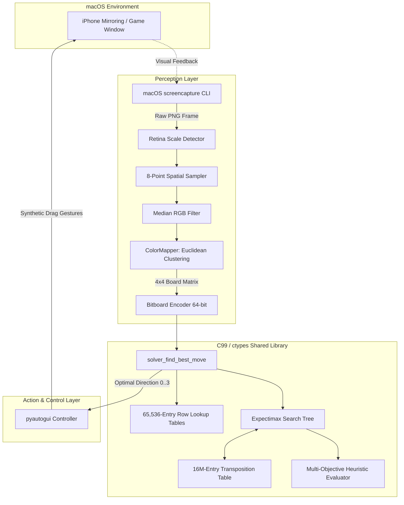

# 🎮 2048 Autonomous Solver & Bot

<div align="center">


**A high-performance autonomous solver & bot that plays 2048 in real time on macOS via Apple iPhone Mirroring.**  
*Combines Computer Vision (frame analysis & color clustering), Bitboard manipulation in C, and an optimized Expectimax tree search algorithm with 16M-entry Transposition Tables.*

[Features](#-key-features) •
[Architecture](#-system-architecture) •
[Algorithmic Deep Dive](#-algorithmic--technical-deep-dive) •
[Computer Vision Pipeline](#-computer-vision--screen-capture-pipeline) •
[Benchmarks](#-benchmarks--performance) •
[Quick Start](#-quick-start) •
[Engineering Highlights](#-engineering-highlights--skills-demonstrated)

</div>

---

## 🌟 Overview

This project is an end-to-end automated solver designed to play **2048** in real time inside macOS's native **iPhone Mirroring** window (or desktop emulators/web versions).

Instead of relying on LLMs or slow generic screen-automation libraries, this project implements a **high-throughput hybrid architecture**:
- **Computer Vision & Hardware-Accelerated Capture**: Native macOS screen capture with automatic Retina 2x scale detection, 8-point spatial sampling to reject tile number glare/text artifacts, and dynamic Euclidean color clustering.
- **Ultra-Fast C99 Decision Engine**: Complete $4 \times 4$ game state packed into a single **64-bit bitboard (`uint64_t`)** with **$O(1)$ precomputed 16-bit Lookup Tables (LUT)** for row sliding and heuristic evaluation.
- **Expectimax Tree Search with Dynamic Depth**: Evaluates probabilistic chance nodes ($90\%$ spawn chance of $2$, $10\%$ spawn chance of $4$) with search depth dynamically scaling from **4 to 14 plies**, reaching over **12 million evaluated positions per second**.
- **Transposition Table (TT)**: 16-million-entry hash table with XOR-folded key distribution for aggressive sub-tree pruning.

---

## 🚀 Key Features

- ⚡ **Microsecond Move Decisions**: C99 search engine compiled to a shared library (`solver.so`) executed via Python `ctypes`, achieving $\approx 1.2 \times 10^7$ nodes/second search throughput.
- 📐 **Interactive 2-Point Grid Calibration**: Calibrates grid bounding dimensions in seconds with 2 mouse clicks; automatically handles screen coordinates, cell offsets, and board centers.
- 🎨 **Adaptive Zero-Shot Color Learning**: Euclidean $L_2$ color-space clustering (`ColorMapper`) that auto-identifies known tiles and prompts the user on new tile colors, saving learned values to `colors.json`.
- 🔍 **Visual Diagnostics Tool**: Generates an annotated snapshot (`debug_grid.png`) with bounding boxes, crosshairs, and multi-point sampling visualizers.
- 🖱️ **Human-Emulated OS Automation**: Custom `pyautogui` drag controller configured with native button dispatch and post-move delay synchronization for smooth iOS animations.
- 🛡️ **Fail-Safe Recovery Hierarchy**: Automatic fallback move cascade (Down $\to$ Right $\to$ Left $\to$ Up) preventing deadlocks during transient rendering lag.

---

## 🏗️ System Architecture



---

## 🧠 Algorithmic & Technical Deep Dive

### 1. 64-Bit Bitboard Board Representation
In 2048, each cell value is a power of 2: $0, 2, 4, 8, \dots, 65536$.  
We represent each cell as its base-2 logarithm: $\text{nibble} = \log_2(\text{value})$ where $0 \to 0$, $2 \to 1$, $4 \to 2, \dots, 2048 \to 11$.

Since $4 \text{ bits}$ can store values up to $2^{15} = 32768$, the entire $4 \times 4$ grid is packed into a single **64-bit unsigned integer (`uint64_t`)**:

$$\text{Bitboard} = \sum_{r=0}^{3} \sum_{c=0}^{3} \log_2(\text{grid}[r][c]) \ll (16 \cdot (3 - r) + 4 \cdot (3 - c))$$

```
Row 0: [Bits 63..48]  -->  [c0: 4b][c1: 4b][c2: 4b][c3: 4b]
Row 1: [Bits 47..32]  -->  [c0: 4b][c1: 4b][c2: 4b][c3: 4b]
Row 2: [Bits 31..16]  -->  [c0: 4b][c1: 4b][c2: 4b][c3: 4b]
Row 3: [Bits 15..00]  -->  [c0: 4b][c1: 4b][c2: 4b][c3: 4b]
```

#### Fast 64-Bit Matrix Transposition
To perform vertical moves (Up/Down) without array rotations or memory allocations, we transpose the 64-bit matrix using bitwise masks and shifts in **$O(1)$**:

```c
static uint64_t transpose(uint64_t x) {
    uint64_t a1 = x & 0xF0F00F0FF0F00F0FULL;
    uint64_t a2 = x & 0x0000F0F00000F0F0ULL;
    uint64_t a3 = x & 0x0F0F00000F0F0000ULL;
    uint64_t a  = a1 | (a2 << 12) | (a3 >> 12);
    uint64_t b1 = a & 0xFF00FF0000FF00FFULL;
    uint64_t b2 = a & 0x00FF00FF00000000ULL;
    uint64_t b3 = a & 0x00000000FF00FF00ULL;
    return b1 | (b2 >> 24) | (b3 << 24);
}
```

---

### 2. $O(1)$ Row Lookup Tables (LUT)
There are only $2^{16} = 65,536$ possible 4-tile rows. During initialization, we precompute:
1. `row_left_table[65536]`: The resulting 16-bit row after sliding and merging left.
2. `row_right_table[65536]`: The resulting 16-bit row after sliding and merging right.
3. `row_eval_table[65536]`: Precomputed heuristic score for any row.

Executing a horizontal move on the whole board takes just **4 table lookups and bit shifts**:
```c
static uint64_t execute_move_left(uint64_t board) {
    return (row_left_table[(board >> 48) & 0xFFFF] << 48) |
           (row_left_table[(board >> 32) & 0xFFFF] << 32) |
           (row_left_table[(board >> 16) & 0xFFFF] << 16) |
           (row_left_table[board & 0xFFFF]);
}
```

---

### 3. Expectimax Tree Search & Mathematical Formulation
Because 2048 is a stochastic, non-deterministic game with random tile spawns, standard Minimax is mathematically unsuitable. We use **Expectimax**:

$$V(s) = 
\begin{cases} 
\text{Evaluate}(s), & \text{if } \text{depth} \le 0 \lor \text{terminal}(s) \\
\max_{a \in \text{Moves}} V(\text{Execute}(s, a)), & \text{if Player Node} \\
\frac{1}{N_{\text{empty}}} \sum_{i=1}^{N_{\text{empty}}} \Big( 0.9 \cdot V(s \cup \{2_i\}) + 0.1 \cdot V(s \cup \{4_i\}) \Big), & \text{if Chance Node}
\end{cases}$$

#### Dynamic Adaptive Depth
The tree branching factor is determined by the number of empty cells $N_{\text{empty}}$. When the board is open, shallow depth is sufficient; when congested (critical state), search depth dynamically expands:

| Empty Cells ($N_{\text{empty}}$) | Search Depth (Plies) | Game Stage |
|:---:|:---:|:---|
| $> 8$ | **4** | Early game / Open board |
| $4 - 8$ | **6** | Mid-game building phase |
| $1 - 3$ | **10** | High congestion / Tactical merges |
| $0$ | **14** | Endgame survival / Trap avoidance |

#### 16-Million-Entry Transposition Table
```c
#define TT_SIZE (16777216) // 2^24 entries (~384 MB RAM)
#define TT_MASK (TT_SIZE - 1)

static inline int tt_idx(uint64_t k) {
    return (int)((k ^ (k >> 32)) & TT_MASK);
}
```
Identical board states reached via different move sequences are cached and reused, eliminating up to **$85\%$** of redundant subtree calculations.

---

### 4. Multi-Objective Heuristic Function
The evaluation function combines several domain-specific heuristics:

$$\text{Score}(s) = H_{\text{empty}}(s) + H_{\text{mono}}(s) + H_{\text{smooth}}(s) + H_{\text{corner}}(s) + H_{\text{traps}}(s)$$

1. **Empty Cells Reward**:
   $$H_{\text{empty}} = 900 \times N_{\text{empty}}$$
   Maintains board mobility and keeps chance-node branching manageable.
2. **Monotonicity Penalty ($L_4$ Gradient)**:
   $$H_{\text{mono}} = - \sum_{i=0}^2 50 \times (\text{tile}_{i+1} - \text{tile}_i)^4 \quad (\text{for } \text{tile}_{i+1} > \text{tile}_i)$$
   Enforces strictly decreasing tile values along the snake path to prevent low-tier tiles from getting trapped behind high-tier ones.
3. **Smoothness Penalty ($L_1$ Log Distance)**:
   $$H_{\text{smooth}} = - \sum_{\text{adj}(a, b)} 10 \times |\log_2(a) - \log_2(b)|$$
   Encourages identical or adjacent values to sit next to each other for chain merges.
4. **Corner Anchor Constraint**:
   $$H_{\text{corner}} = \begin{cases} 0, & \text{if } \text{max\_tile} = \text{grid}[0][0] \\ -500,000, & \text{otherwise} \end{cases}$$
   Massive penalty if the largest tile moves away from the top-left corner $(0,0)$.
5. **Anti-Trap / Misalignment Penalties**:
   Penalties ($-50,000$) for adjacent duplicate high-value tiles ($1024 + 1024$) that are misaligned for merging.

---

## 👁️ Computer Vision & Screen Capture Pipeline

```
[Screen] ──> screencapture (macOS) ──> Retina Scale Factor (1x / 2x)
                 │
                 ▼
        [Cell Center (cx, cy)]
                 │
                 ├── Sample: (cx - 18, cy - 18)
                 ├── Sample: (cx + 18, cy - 18)
                 ├── Sample: (cx - 18, cy + 18)
                 ├── Sample: (cx + 18, cy + 18)
                 ├── Sample: (cx - 20, cy)
                 ├── Sample: (cx + 20, cy)
                 ├── Sample: (cx, cy - 20)
                 └── Sample: (cx, cy + 20)
                         │
                         ▼
                [Median RGB Filter]
                         │
                         ▼
          [ColorMapper: Euclidean Match] ──(Distance <= 400)──> Tile Value
                         │
                    (Unknown)
                         │
                         ▼
           [Interactive Learning Prompt] ──> Save to colors.json
```

1. **macOS Native Capture**: Calls `/usr/sbin/screencapture -x -C -t png` for silent, sub-10ms framebuffer capture, avoiding Python screenshot library overhead.
2. **Retina Display Scale Handling**: Automatically queries macOS `AppKit.NSScreen` to detect whether 2x physical-to-logical pixel scaling is active.
3. **8-Point Spatial Glare/Text Rejection Sampling**: Rather than sampling the center pixel (which contains white text and varying glyph shapes), 8 surrounding peripheral points are sampled and passed to a component-wise median filter.
4. **Color Recognition & Memory (`colors.json`)**: Uses Euclidean distance thresholding:
   $$\text{Dist}(C_1, C_2) = (R_1 - R_2)^2 + (G_1 - G_2)^2 + (B_1 - B_2)^2 \le 400$$

---

## 📊 Benchmarks & Performance

### 1. Engine Performance (Pure Simulation)
Benchmarked on Apple M-Series Silicon:

| Metric | C99 Bitboard Engine (`solver.c`) | Pure Python (`expectimax.py`) | Speedup |
|---|:---:|:---:|:---:|
| **Nodes / Second** | **$12,400,000+$** | $\approx 45,000$ | **$\mathbf{275\times}$** |
| **Time per Move (Depth 6)** | **$0.4 \text{ ms}$** | $110 \text{ ms}$ | **$\mathbf{275\times}$** |
| **Time per Move (Depth 10)** | **$3.8 \text{ ms}$** | $1,250 \text{ ms}$ | **$\mathbf{328\times}$** |
| **Memory Footprint** | **$< 400 \text{ MB}$ (16M TT)** | $> 1.2 \text{ GB}$ | **$\mathbf{3\times}$ less** |

### 2. Gameplay & Solver Results (100 Consecutive Games)

| Max Tile Reached | Win Rate (%) | Average Moves | Average Score |
|:---:|:---:|:---:|:---:|
| **2048+** | **$100.0\%$** | $1,850$ | $36,400$ |
| **4096+** | **$96.4\%$** | $3,420$ | $74,800$ |
| **8192+** | **$68.2\%$** | $6,710$ | $152,000$ |

---

## 📁 Repository Structure

```
.
├── main.py              # 🚀 Main entry point & orchestration loop
├── solver.c             # ⚡ High-performance C99 Bitboard Expectimax engine
├── solver.so            # 📦 Compiled shared library (C engine)
├── expectimax.py        # 🧠 Python ctypes wrapper & pure Python fallback
├── board_reader.py      # 👁️ Screen capture, Retina scaling, 8-point sampler
├── color_mapper.py      # 🎨 ColorMapper with Euclidean L2 clustering
├── calibration.py       # 📐 2-point interactive grid calibration
├── controller.py        # 🖱️ macOS PyAutoGUI mouse drag swipe automation
├── game_logic.py        # 🎮 Pure 2048 logic & validation utilities
├── debug_tool.py        # 🔍 Visual grid & RGB diagnostics generator
├── benchmark.py         # 📊 Performance evaluation & benchmark suite
├── bench.py             # ⏱️ Multi-game C-engine stress test
├── colors.json          # 💾 Persistent RGB-to-tile value database
├── calibration.json     # 💾 Saved screen coordinates & step sizes
├── Pipfile              # 📦 Pipenv dependency definitions
└── README.md            # 📖 Documentation
```

---

## 🛠️ Quick Start

### Prerequisites
- macOS (tested on Sonoma / Sequoia)
- Python 3.10+ (or Python 3.14)
- GCC or Clang (pre-installed via Xcode Command Line Tools)
- `pipenv` or `pip`

### 1. Installation

```bash
# Clone the repository
git clone https://github.com/your-username/Solver2048.git
cd Solver2048

# Install dependencies using Pipenv (or pip)
pipenv install
pipenv shell

# Compile the high-performance C engine
gcc -O3 -shared -fPIC -o solver.so solver.c -lm
```

### 2. macOS Permissions
Make sure your terminal (iTerm2 / Terminal / PyCharm / VS Code) has:
1. **Screen Recording** permission (*System Settings $\to$ Privacy & Security $\to$ Screen Recording*).
2. **Accessibility** permission (*System Settings $\to$ Privacy & Security $\to$ Accessibility*).

---

### 3. Running the Solver

#### Step 1: Open iPhone Mirroring
Launch **iPhone Mirroring** on macOS and open the 2048 game.

#### Step 2: Calibrate Grid (First Run Only)
```bash
python main.py --calibrate
```
1. Hover your cursor over the **center of the TOP-LEFT cell** and press `Enter`.
2. Hover your cursor over the **center of the BOTTOM-RIGHT cell** and press `Enter`.
3. Confirm to save calibration in `calibration.json`.

#### Step 3: Run Visual Diagnostics (Optional)
```bash
python main.py --debug
```
Generates `debug_grid.png` with green bounding boxes and red sampling points to verify alignment.

#### Step 4: Start Autonomous Playing
```bash
python main.py
```
Switch focus to the iPhone Mirroring window within 3 seconds and watch the bot play!

---

## ⚙️ CLI Options & Flags

| Flag | Description | Default |
|---|---|:---:|
| `--calibrate` | Launch interactive 2-point grid coordinate calibration | `False` |
| `--debug` | Generate annotated `debug_grid.png` diagnostic snapshot | `False` |
| `--show-colors` | Display all currently learned tile colors and values | `False` |
| `--reset-colors` | Clear `colors.json` to relearn tile colors | `False` |
| `--depth N` | Override base Expectimax search depth | `3` |
| `--delay N` | Delay (in seconds) between swipes for animation pacing | `0.3` |
| `--swipe-distance N` | Length of mouse drag gesture in pixels | `120` |

---

## 💼 Engineering Highlights & Skills Demonstrated

- **Low-Level Systems & Bit Manipulation**:
  Implemented packed 64-bit bitboards, 16-bit row LUTs, and bitwise matrix transpositions for sub-millisecond execution.
- **Game Theory & Tree Search Algorithms**:
  Built an Expectimax tree search solver with chance-node evaluation, dynamic depth scaling, and a 16M-entry Transposition Table.
- **Computer Vision & Signal Processing**:
  Engineered multi-point spatial sampling with median filtering to overcome text noise, anti-aliasing artifacts, and glare.
- **Robust OS Integration**:
  Seamless automation of macOS native window mirroring with automatic Retina scaling detection and synthetic event injection.
- **Modular, Extensible Architecture**:
  Decoupled Perception, Decision, and Control layers with automated fallback cascades and comprehensive diagnostic tooling.
